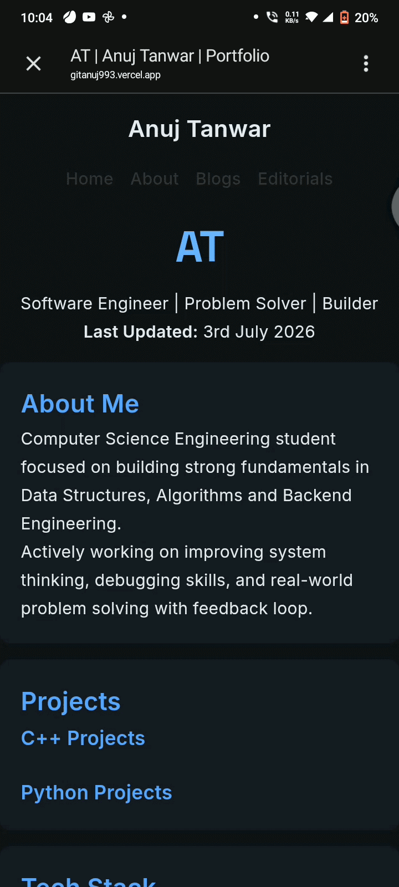

## 🎀 About AT

## Tech Stack 

 Communication Languages

  

 Programming Languages

  

      
## Skills & Tools 

### 🎀 Personal habits 🎀

🎨 **Hobbies:** Literature learning , Basketball sport , chess .  
🎯 **Current Goal:** DSA practice,CPP,Python
✨ **Life Motto:** Feedback driven mindset

---

## 💌 Let's Connect & Create Magic Together! 💌

## GitHub Stats & Performance 

## FIFA style Card

     

### 🚀 Nice to See You here ! 

 <em><b>I love connecting with different people</b> if you want to discuss and implement ideas and projects reach out to me.<b>hi, I'll be glade to connect with you!</b> 😊</em>

  

